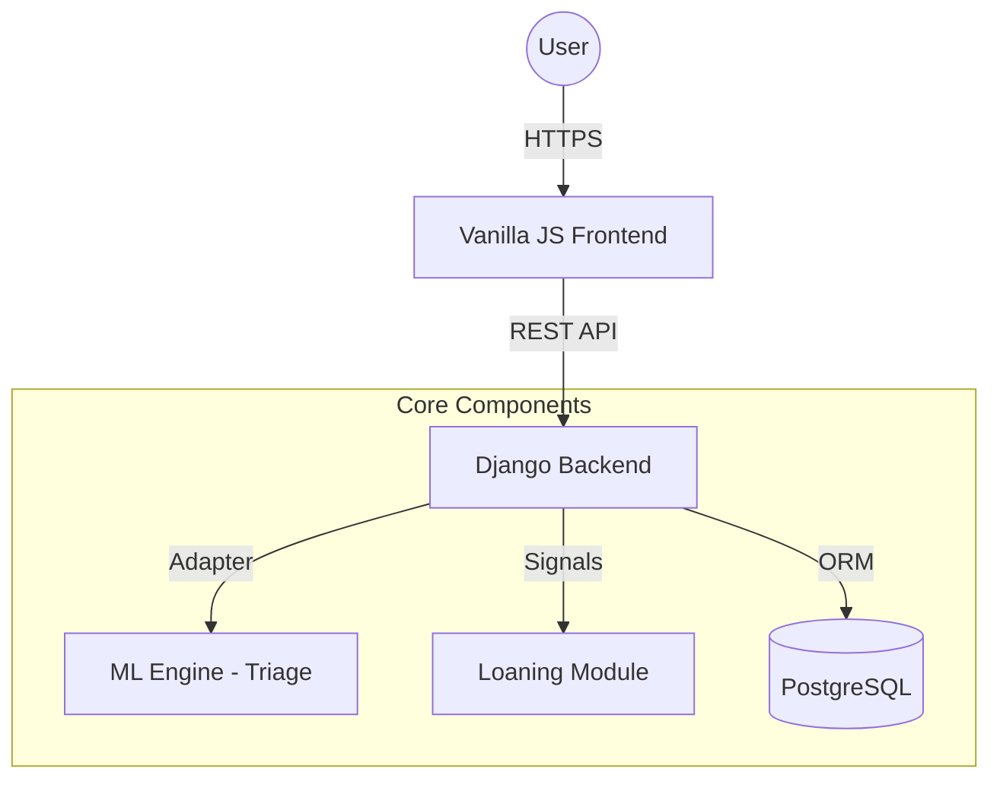
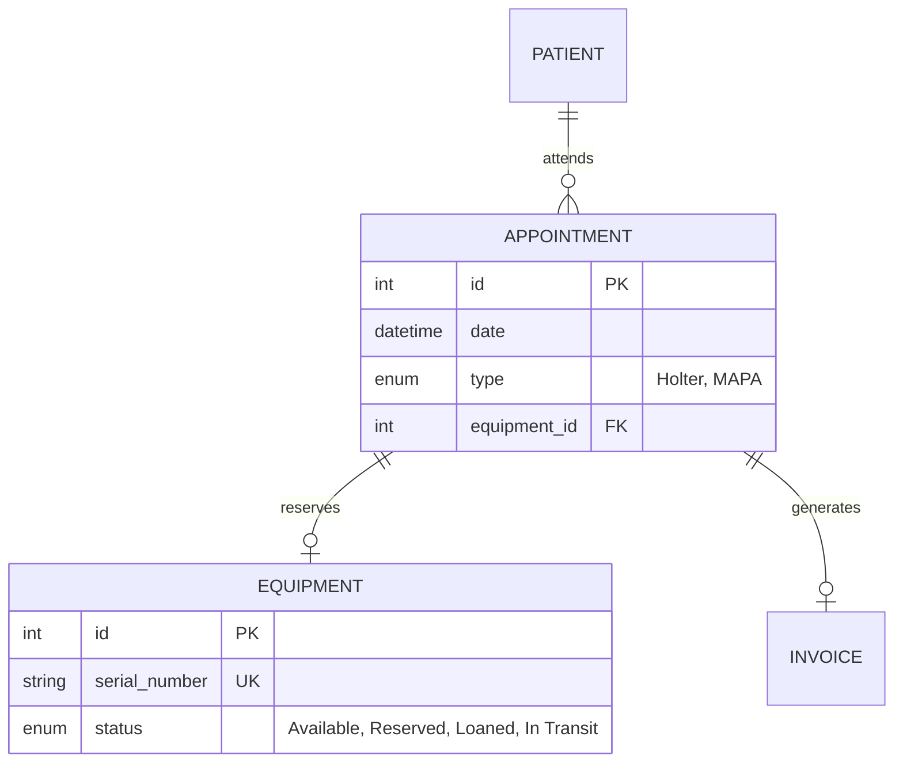

# 🚀 Full Report: CardioBot

This document serves as the master record for the **CardioBot** project, tracking progress from initial planning through to technical design and final delivery.

---

## Team, Governance & Work Standards 👥

### Team Composition and Roles

| Member | Primary Project Role | Primary Technical Focus | Key Rationale & Competence |
| --- | --- | --- | --- |
| **Patrick** | **Project Manager (PM)** | CyberSecurity Student | **Final Decision Maker** on scope and technical feasibility. Focuses on **ISO 27005** compliance and overall security posture. |
| **Benjamin** | PM Support | CyberSecurity Student | Focuses on **HDS Certification** compliance, secure deployment, and infrastructure hardening. |
| **Fjolla** | Team Member | Machine Learning (ML) Student | Responsible for developing, training, and integrating the specialized **CardioBot** AI agent model. |
| **Valentin** | Team Member | Full Stack Student | Responsible for API implementation, system integration, and the **"1-click" UI** (JS, CSS, HTML). |

---

### Collaboration, Decision, and Work Standards

| Standard Category | Norm / Tool | Actionable Work Standard |
| --- | --- | --- |
| **Communication** | Discord, Weekly Stand-ups | Bi-weekly client meeting with Dr. Tzvetkov to review progress. |
| **Decision Process** | PM-led (Patrick) | Final authority on technical decisions; client requests prioritized by PM. |
| **Code Quality** | Private GitHub, Dev Branches | **Mandatory Peer Review (PR)** before merging to `main`. |
| **Security & Testing** | Agile Board / Trivy Scans | **Security Unit Tests** and automated vulnerability scanning on every PR. |
| **Productivity** | Advancement Meetings | **Feature Definition First:** Technical specs must be approved before coding. |

---

## Project Vision & Objectives

### Client & Core Problem

* **Primary Stakeholder:** Dr. Tzvetkov (Cardiologist, Product Owner).
* **Core Problem:** Existing solutions (scheduling, billing, equipment tracking, patient data) are fragmented, complex, and lack high-level security certification required for medical data.
* **Vision:** To create a **single, secure, web-based UCPM platform** that simplifies all practice workflows into an efficient "1-click" experience.

### Technical Stack

The choice of technologies prioritizes security, stability, and scalability for handling Protected Health Records (PHR).

| Component | Technology / Framework | Rationale |
| --- | --- | --- |
| **Backend / API** | **Python (Django)** | Robust, built-in security features (ORM, Auth, CSRF) essential for **ISO 27005** and **HDS** compliance. |
| **Frontend** | **Vanilla JS, HTML5, CSS (BEM)** | Focus on lightweight design for superior performance and flexibility to implement the simple "1-click" user experience. |
| **Database** | **PostgreSQL** | Trusted, enterprise-grade open-source database with advanced security and integrity features required for PHR data. |
| **Machine Learning** | **Python (TensorFlow / NLTK)** | Necessary for developing the complex Natural Language Processing (NLP) models for the **CardioBot** AI agent. |

---

## Technical Documentation & Design ⚙️

### System Architecture

The application uses a **Modular Monolith** architecture. The Django backend acts as the central hub, utilizing an **Adapter/Entity** pattern to communicate with the ML engine while the frontend consumes a REST API.

### Holter Loaning Module: Business Logic

Based on the finalized business rules, hardware logistics are now automated within the clinical workflow:

* **Auto-Reservation:** Creating an appointment of type "Holter" or "MAPA" automatically queries for available hardware and locks it to that specific slot.
* **Status Lifecycle:** `Available` → `Reserved` (on booking) → `Loaned` (at check-in) → `In Transit` (post-visit) → `Cleaning/Available`.
* **Transactional Integrity:** Deleting or cancelling an appointment immediately triggers a signal to release the reserved equipment back into the pool.

### Database Schema (ERD)

The schema is designed to link patient interactions with physical hardware inventory and clinical outcomes.

---

## Project High-Level Plan & Timeline 📅

The project is structured into five sequential stages with specific milestones, leading to the non-negotiable **Demo Day deadline of March 20, 2026.**

| Stage | Duration | Date Range | Key Milestones & Deliverables |
| --- | --- | --- | --- |
| **Stage 1** | *Completed* | *Nov 2025* | **Project Idea & Team Formation.** ✅ |
| **Stage 2** | *Completed* | *Dec 2025* | **Project Planning & Charter.** ✅ |
| **Stage 3** | *Completed* | *Dec 15 - Jan 9, 2026* | **Technical Documentation.** Finalize Architecture, ERD, and Loaning Logic. ✅ |
| **Stage 4** | 7 Weeks | Jan 12 - Mar 6, 2026 | **MVP Development.** Implement core modules in sprints (Triage, Billing, Loaning UI). 🔵 |
| **Stage 5** | 2 Weeks | Mar 9 - Mar 20, 2026 | **Project Closure.** End-to-End Testing, Security Audit, and Final Presentation. |

---

## Minimum Viable Product (MVP) Scope

### Feature Definition and Boundaries

| Feature Area | IN-SCOPE (MUST Deliver) | Status |
| --- | --- | --- |
| **User Roles** | Patient, Practitioner, Sub-Admin (Receptionist). | Designed |
| **Appointment** | Basic booking from index page with automated equipment linking. | Logic Finalized |
| **ML AI Agent** | Symptom Triage with emergency escalation (SAMU/15). | Specs Defined |
| **Equipment** | Manual & Automated status tracking (Available, Loaned, In Transit). | Logic Finalized |
| **Billing** | PDF invoice generation and printing module. | Specs Defined |

### Quantified Success Metrics

| Metric | Proposed Target | Justification |
| :--- | :--- | :--- |
| **Core Page Load Time (LCP)** | **$\le 2.0$ seconds** | A fast user experience is non-negotiable for the "1-click" goal. This meets the performance standards of top-tier web applications. |
| **Chatbot Triage Accuracy** | **$\ge 90\%$** | Essential for a medical application. A minimum of 90% accuracy in correctly identifying and triaging high-risk symptoms ensures patient safety and trust. |
| **Appointment Booking Completion Rate (GCR)** | **$\ge 85\%$** | Measures the effectiveness of the simple UI. If 85% of patients who start booking successfully complete it, the UCPM has successfully replaced the previous fragmented systems. |

---

## Executive Summary

The **CardioBot** has transitioned from conceptual planning to a fully documented technical blueprint. A major achievement of the current phase is the integration of the **Holter Loaning Module**, which eliminates manual tracking errors by tying equipment availability directly to the appointment schedule. By leveraging **Django's** security features and a specialized **ML agent**, the practice is prepared to handle sensitive patient data while significantly reducing administrative overhead. The project is currently entering **Stage 4: MVP Development**.