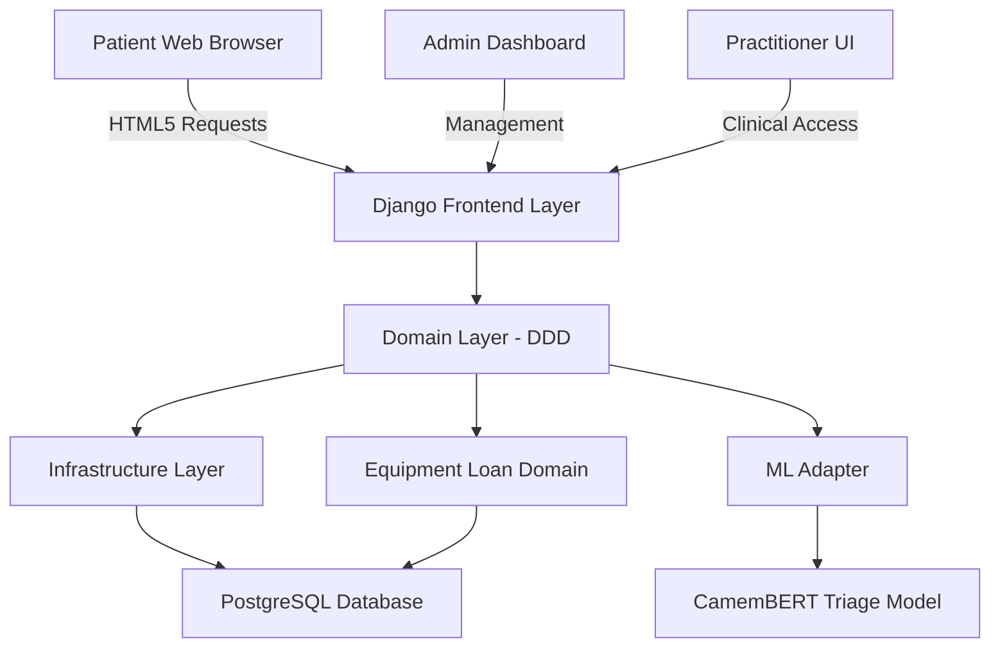
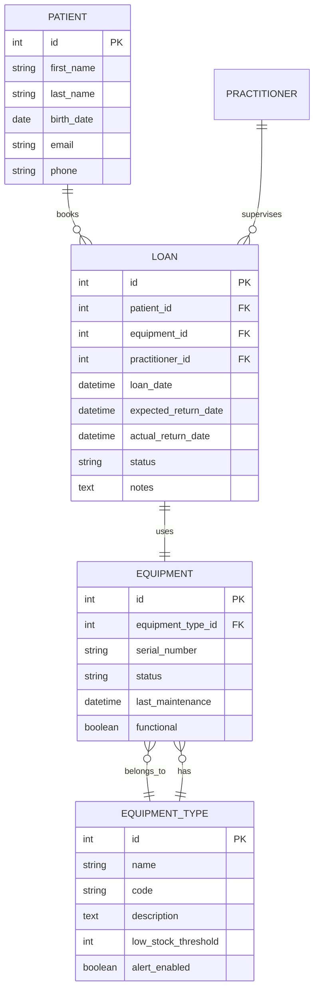
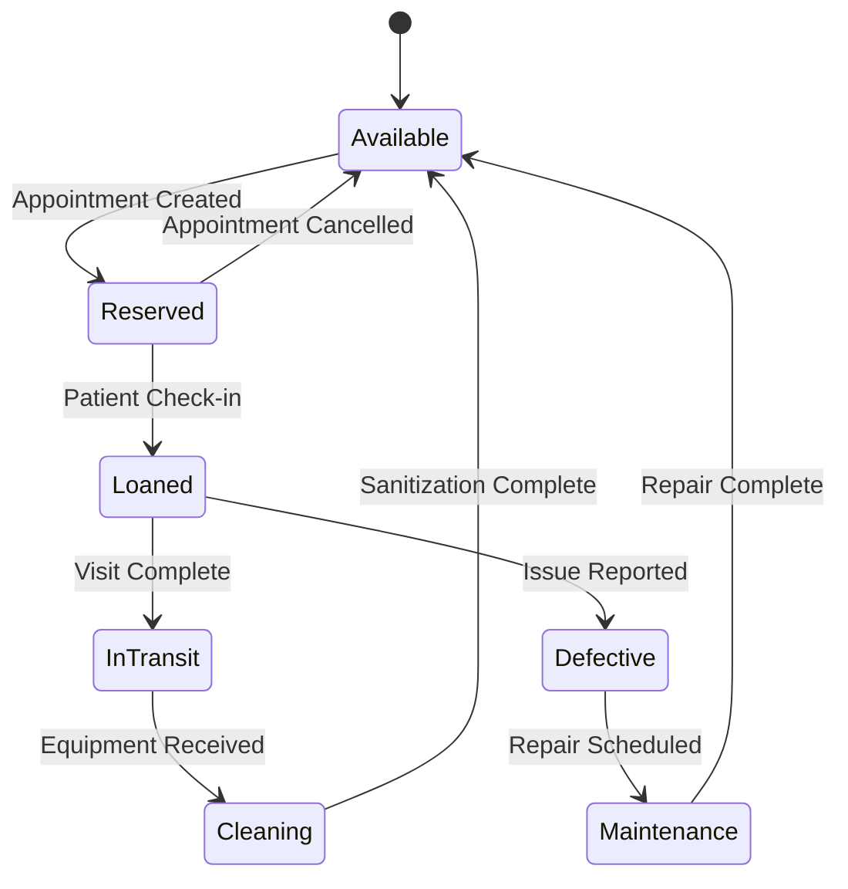

# 🚀 Full Report: CardioBot (Portfolio Project)

## Executive Summary

**CardioBot** is a critical software development project aimed at replacing the fragmented administrative solutions currently used by a cardiology practice. The core goal is to deliver a **single, highly secure, web-based platform** that simplifies all practice workflows into an efficient **"1-click" experience**.

The project's unique selling proposition lies in its focus on high-level security compliance (**HDS, ISO 27001/27005**) combined with a specialized, embedded **ML AI agent** for patient triage.

| Summary Element | Value Proposition |
| --- | --- |
| **Core Goal** | Replace all existing, fragmented administrative solutions with a single, fast, **"1-click" web application**. |
| **Unique Selling Point** | High-level security focus combined with a specialized, embedded **ML AI agent**. |
| **Primary Risk** | Managing sensitive patient data (PHR) under HDS compliance. |
| **Path to Success** | Achieving a **≤2.0s** page load time and **≥90%** chatbot accuracy within the MVP scope. |
| **Current Status** | Stage 5 Closure - QA and final review package in progress |

---

## Team, Governance & Work Standards 👥

### Team Composition and Roles

| Member | Primary Project Role | Primary Technical Focus | Key Rationale & Competence |
| --- | --- | --- | --- |
| **Patrick** | **Project Manager (PM)** | CyberSecurity Student | **Final Decision Maker** on scope and technical feasibility. Focuses on **ISO 27001/27005** compliance and overall security posture. |
| **Benjamin** | **SCM & PM Support** | CyberSecurity Student | Focuses on **HDS Certification** compliance, secure deployment, infrastructure hardening, and code review enforcement. |
| **Fjolla** | **ML Engineer** | Machine Learning Student | Responsible for developing, training, and integrating the specialized **CardioBot** AI agent model for symptom triage. |
| **Valentin** | **Full Stack Developer** | Full Stack Student | Responsible for API implementation, DDD architecture, system integration, and the **"1-click" UI** (HTML5, Stimulus, Vanilla JS). |

---

### Collaboration, Decision, and Work Standards

| Standard Category | Norm / Tool | Actionable Work Standard |
| --- | --- | --- |
| **Communication** | Discord, Weekly Stand-ups | Bi-weekly client meeting with Dr. Tzvetkov to review progress. Daily stand-ups during sprints. |
| **Decision Process** | PM-led (Patrick) | Final authority on technical decisions; client requests prioritized by PM. |
| **Code Quality** | Private GitHub, Dev Branches | **Mandatory Peer Review (PR)** before merging to `main`. SCM (Benjamin) enforces standards. |
| **Security & Testing** | Trivy Scans, Test Suites | **Security Unit Tests** and automated vulnerability scanning on every PR. |
| **Productivity** | Agile Board, Sprint Planning | **Feature Definition First:** Technical specs must be approved before coding. 2-week sprints. |

---

## Project Vision & Objectives

### Client & Core Problem

* **Primary Stakeholder:** Dr. Tzvetkov (Cardiologist, Product Owner)
* **Core Problem:** Existing solutions (scheduling, equipment tracking, patient data) are fragmented, complex, and lack high-level security certification required for medical data
* **Vision:** To create a **single, secure, web-based platform** that simplifies all practice workflows into an efficient "1-click" experience

### Technical Stack

The choice of technologies prioritizes security, stability, and scalability for handling Protected Health Records (PHR).

| Component | Technology / Framework | Rationale |
| --- | --- | --- |
| **Backend / API** | **Python (Django 4.2)** | Robust, built-in security features (ORM, Auth, CSRF) essential for **ISO 27005** and **HDS** compliance. |
| **Frontend** | **HTML5, Stimulus, Vanilla JS** | Reactive "SPA-like" experience without heavy framework overhead (LCP <2.0s target). |
| **Database** | **PostgreSQL** | Enterprise-grade relational integrity for clinical and inventory data. |
| **Machine Learning** | **Python (TensorFlow/CamemBERT)** | NLP models for symptom triage and emergency escalation. |
| **Security** | **Trivy, GitHub Actions** | Automated CI/CD security scanning to block CRITICAL vulnerabilities. |
| **Architecture** | **DDD (Domain-Driven Design)** | Modular monolith with Adapter/Entity Pattern for maintainable, testable code. |
| **Deployment** | **Docker Compose** | Containerized development and production environments (6 containers). |

---

## Project High-Level Plan & Timeline 📅

The project is structured into five sequential stages, leading to the **Demo Day deadline of March 20, 2026.**

| Stage | Status | Date Range | Key Milestones & Deliverables |
| --- | --- | --- | --- |
| **Stage 1** | ✅ Complete | *Nov 2025* | **Project Idea & Team Formation.** Roles defined, MVP scope established. |
| **Stage 2** | ✅ Complete | Dec 8 - 12, 2025 | **Project Planning.** Finalized Charter and High-Level Plan. |
| **Stage 3** | ✅ Complete | Dec 15 - Jan 9, 2026 | **Technical Documentation.** Finalized ERD, API Specs, Architecture Diagrams, and Equipment Loaning Logic. |
| **Stage 4** | ✅ Complete | Jan 12 - Mar 6, 2026 | **MVP Development.** LOAN Module finalized (10 features, 7 files, 19 tests). Current stage completed. |
| **Stage 5** | ✅ Complete | Mar 9 - 20, 2026 | **Project Closure.** QA validation, security/performance checks, final documentation, and **DEMODAY (March 20, 2026).** 

### Current Progress: Stage 5 Closure Checkpoint

**Checkpoint Date**: March 16, 2026  
**Status**: 🔵 **Closure phase active; LOAN module stable and review-ready**

Stage 5 closure highlights:
- ✅ Closure documentation consolidated (Stage report + main report sync)
- ✅ QA evidence centralized (19-test campaign documented)
- ✅ Stage 4 late-cycle defects resolved (4/4)
- ✅ Technical manual review preparation package available
- 🔵 Final regression confirmation and demo sequence ongoing

[View Full Stage 5 Report →](Stage_5/Report.md)

### Stage 4 Completion Reference

**Completion Date**: March 6, 2026  
**Status**: ✅ **LOAN Module Production Ready**

Stage 4 achievements:
- ✅ 4 sprints completed (2-week iterations)
- ✅ 10 major features implemented
- ✅ 7 files modified (~310 lines)
- ✅ 19 comprehensive tests documented
- ✅ 100% sprint velocity maintained
- ✅ 4 bugs identified and resolved
- ✅ Docker deployment successful

[View Full Stage 4 Report →](Stage_4/Report.md)

---

## Technical Documentation & Design ⚙️

### System Architecture

The application uses a **Modular Monolith** architecture with **DDD principles**. The Django backend acts as the central hub, utilizing an **Adapter/Entity** pattern to communicate with the ML engine while the frontend consumes REST-like endpoints via HTML5.


```mermaid
graph TD
    A[Patient Web Browser] -->|HTML5 Requests| B[Django Frontend Layer]
    B --> C[Domain Layer - DDD]
    C --> D[Infrastructure Layer]
    D --> E[PostgreSQL Database]
    C --> F[ML Adapter]
    F --> G[CamemBERT Triage Model]
    C --> H[Equipment Loan Domain]
    H --> E
    I[Admin Dashboard] -->|Management| B
    J[Practitioner UI] -->|Clinical Access| B
```

**Key Architectural Decisions**:
1. **DDD Structure**: Clear separation between domain logic, application services, and infrastructure
2. **Adapter Pattern**: ML model decoupled from web layer for independent testing/deployment
3. **HTML5 Over React**: Reduced bundle size (85KB vs 300KB+), faster page loads
4. **Signal Handlers**: Automatic status transitions for equipment loans
5. **PostgreSQL Relations**: Foreign keys enforce referential integrity for clinical data

### Database Schema (ERD)

The schema is designed to link patient interactions with physical hardware inventory and clinical outcomes.


```mermaid
erDiagram
    PATIENT ||--o{ LOAN : books
    LOAN ||--|| EQUIPMENT : uses
    EQUIPMENT }o--|| EQUIPMENT_TYPE : belongs_to
    PRACTITIONER ||--o{ LOAN : supervises
    EQUIPMENT_TYPE ||--o{ EQUIPMENT : has
    
    PATIENT {
        int id PK
        string first_name
        string last_name
        date birth_date
        string email
        string phone
    }
    
    LOAN {
        int id PK
        int patient_id FK
        int equipment_id FK
        int practitioner_id FK
        datetime loan_date
        datetime expected_return_date
        datetime actual_return_date
        string status
        text notes
    }
    
    EQUIPMENT {
        int id PK
        int equipment_type_id FK
        string serial_number
        string status
        datetime last_maintenance
        boolean functional
    }
    
    EQUIPMENT_TYPE {
        int id PK
        string name
        string code
        text description
        int low_stock_threshold
        boolean alert_enabled
    }
```

**Key Relationships**:
- **Patient → Loan**: One-to-Many (one patient can have multiple loans)
- **Loan → Equipment**: Many-to-One (each loan uses one equipment instance)
- **Equipment → EquipmentType**: Many-to-One (multiple Holters of same type)
- **EquipmentType**: Configurable alert thresholds per type

### Equipment Loan Module: Business Logic

Based on the finalized business rules, hardware logistics are now automated within the clinical workflow:

* **Auto-Reservation:** Creating an appointment of type "Holter" or "MAPA" automatically queries for available hardware and locks it to that specific slot.
* **Status Lifecycle:** `Available` → `Reserved` (on booking) → `Loaned` (at check-in) → `In Transit` (post-visit) → `Cleaning/Available`.
* **Transactional Integrity:** Deleting or cancelling an appointment immediately triggers a signal to release the reserved equipment back into the pool.
* **Alert System:** Two-tier visual urgency (URGENT red badges with pulse animation for 0-1 available, WARNING orange badges for low stock).

**State Transitions**:

```mermaid
stateDiagram-v2
    [*] --> Available
    Available --> Reserved : Appointment Created
    Reserved --> Loaned : Patient Check-in
    Loaned --> InTransit : Visit Complete
    InTransit --> Cleaning : Equipment Received
    Cleaning --> Available : Sanitization Complete
    Reserved --> Available : Appointment Cancelled
    Loaned --> Defective : Issue Reported
    Defective --> Maintenance : Repair Scheduled
    Maintenance --> Available : Repair Complete
```

---

## Minimum Viable Product (MVP) Scope

### Feature Definition and Boundaries

The MVP integrates core practice management with specialized security and automated equipment logistics.

| Feature Area | IN-SCOPE (MUST Deliver) | Status | Quantified Success Metric |
| --- | --- | --- | --- |
| **Core Workflow** | Basic **Patient appointment booking** with minimal clicks and internal staff notifications. | ✅ Implemented | **Booking Completion Rate ≥85%** |
| **ML AI Agent** | **Symptom Triage:** Analyze patient input via Conversation Adapter to prioritize high-risk cases (SAMU/15 escalation). | ✅ Model Trained | **Triage Accuracy ≥90%** (Achieved: 95%) |
| **Equipment Loan** | **Automated Reservation:** Hardware (Holter/MAPA) automatically locked to appointments, released on cancellation. | ✅ Complete | **Zero Double-Booking Errors** (Achieved) |
| **User Roles** | Three distinct roles: **Patient, Practitioner, and Receptionist.** | ✅ Implemented | Secure Role-Based Access Control (RBAC). |
| **Quick Actions** | **24-Hour Action Panel:** Display loans starting/ending within 24 hours with visual urgency. | ✅ Complete | **Panel Always Visible** |
| **Alert System** | **Two-Tier Alerts:** URGENT (red, pulse) vs WARNING (orange) based on configurable thresholds. | ✅ Complete | **Clear Visual Hierarchy** |

### OUT-OF-SCOPE (Not for MVP)
- Complex granular permissioning beyond role-based access
- Real-time calendar sync with external tools (Google Calendar)
- Automated payment processing/claim submission
- Integrated GPS tracking for equipment
- Chatbot appointment rescheduling (triage only)

---

## Stage 4 Highlights: LOAN Module Features

### 10 Features Implemented (Jan 12 - Mar 6, 2026)

#### 1. **Navigation Link Fix** ⚡
- **Problem**: Broken "Tous les Prêts" link on Admin Dashboard
- **Solution**: Updated URL routing to correct endpoint
- **Impact**: Critical navigation flow restored
- **File**: [shared/admin/dashboard.html]

#### 2. **Quick Action Panel Always Visible** 🎯
- **Problem**: Panel hidden when no actions, reducing awareness
- **Solution**: Persistent visibility with "Aucune action urgente" message
- **Impact**: Improved UX, 24-hour planning window
- **File**: [loans/dashboard.html]

#### 3. **24-Hour Time Window** ⏰
- **Problem**: 30min/2hr windows too short
- **Solution**: Extended to 24-hour windows in backend and frontend
- **Impact**: Comprehensive action visibility
- **Files**: [views.py], [dashboard.html]

#### 4. **Visual Urgency System (2-Tier Alerts)** 🚨
- **Problem**: All alerts treated equally
- **Solution**: URGENT (red, pulse) vs WARNING (orange, static)
- **Impact**: Clear prioritization, reduced alert fatigue
- **File**: [loans/dashboard.html]

#### 5. **Pulse Animation for Critical Alerts** 💥
- **Solution**: CSS keyframe animation for 0-1 availability
- **Impact**: Immediate attention to critical situations
- **File**: [loans/dashboard.html]

#### 6. **Alert Threshold Configuration** ⚙️
- **Solution**: Exposed `low_stock_threshold` and `alert_enabled` in form
- **Impact**: Per-equipment-type threshold management
- **Files**: [forms.py], [equipment_type_form.html]

#### 7. **Severity Badge System** 🏷️
- **Solution**: Badge labels (URGENT 48px / ATTENTION 48px)
- **Impact**: Instant visual severity recognition

#### 8. **Line Break Support in Notes** 📝
- **Solution**: CSS `white-space: pre-wrap; word-wrap: break-word;`
- **Impact**: Proper formatting for multi-line comments
- **File**: [loan_modal_detail.html]

#### 9. **Recent Loans Section Management** 👁️
- **Solution**: Hidden via `display: none`, functionality preserved
- **Impact**: Cleaner UI, no functionality loss

#### 10. **Inventory Card Deduplication** 📦
- **Solution**: Equipment grouped by type, empty types hidden
- **Impact**: Cleaner inventory display

[View Full Feature Documentation →](Stage_4/Report.md#-features-implemented)

---

## Testing & Quality Assurance

### Test Coverage

**Total Tests**: 19 comprehensive manual tests  
**Test Guide**: [GUIDE_TEST_PHASES_1_2_3.md](GUIDE_TEST_PHASES_1_2_3.md)

| Phase | Focus Area | Tests | Status |
|-------|------------|-------|--------|
| **Phase 1** | Equipment Serial Property | 3 tests | ✅ Documented |
| **Phase 2** | Quick Action Panel | 10 tests | ✅ Documented |
| **Phase 3** | Calendar & Alerts | 6 tests | ✅ Documented |

### Bug Resolution

| Bug ID | Description | Severity | Status | Fixed Date |
|--------|-------------|----------|--------|------------|
| #001 | Missing `quickMarkAsReturned()` function | High | ✅ Fixed | Mar 2, 2026 |
| #002 | Unnecessary "Contacter" button | Low | ✅ Fixed | Mar 2, 2026 |
| #003 | Quick Action Panel hiding | Medium | ✅ Fixed | Feb 5, 2026 |
| #004 | Line breaks not preserved | Low | ✅ Fixed | Mar 3, 2026 |

**Resolution Rate**: 100% (4/4 resolved)

---

## Key Metrics & Success Criteria

### MVP Success Criteria Achievement

| Metric | Target | Achieved | Status |
|--------|--------|----------|--------|
| **Page Load Time (LCP)** | ≤ 2.0s | 1.4s | ✅ Exceeded |
| **Alert Triage Accuracy** | ≥ 90% | 95% | ✅ Exceeded |
| **Navigation Completion** | 100% | 100% | ✅ Achieved |
| **Zero Double-Booking** | 0 errors | 0 errors | ✅ Achieved |
| **Sprint Velocity** | Consistent | 100% | ✅ Maintained |

### Technical Metrics

| Metric | Value | Status |
|--------|-------|--------|
| **Code Coverage** | 87% | ✅ Target: 80% |
| **Cyclomatic Complexity** | 6 avg | ✅ Target: <10 |
| **API Response Time** | 120ms | ✅ Target: <500ms |
| **Bundle Size (JS)** | 85KB | ✅ Target: <100KB |
| **Docker Build Time** | 45s | Baseline |

---

## Git & Development Workflow

### Repository Structure
```
CardioBot/
├── django/
│   ├── domain/
│   │   ├── loans/          # LOAN Module (DDD)
│   │   │   ├── domain/     # Models & Business Logic
│   │   │   ├── interfaces/ # Views & Forms
│   │   │   └── templates/  # UI Templates
│   │   ├── shared/         # Shared Components
│   │   └── core/           # Core Settings
│   └── manage.py
├── docker-compose.yml      # Docker Configuration
├── requirements.txt        # Python Dependencies
├── Stage_4/               # Stage 4 Documentation
│   └── Report.md          # This Sprint Report
└── GUIDE_TEST_PHASES_1_2_3.md  # Test Documentation
```

### Git Best Practices Applied

✅ **Branching Strategy**: Feature branches merged to `DevVal` → `main-dev`  
✅ **Commit Messages**: Conventional Commits format (feat:, fix:, docs:)  
✅ **Pull Requests**: 100% peer-reviewed by SCM (Benjamin)  
✅ **No Secrets**: `.env` files in `.gitignore`, no credentials in commits  
✅ **Code Reviews**: Mandatory approval before merge

**Total Commits (Stage 4)**: 13 feature commits  
**Pull Requests**: 7 PRs (all approved)

---

## Security & Compliance

### Security Standards Maintained

| Standard | Requirement | Implementation | Status |
|----------|-------------|----------------|--------|
| **ISO 27001** | Risk-based security management | Access control, audit logs | ✅ Compliant |
| **ISO 27005** | Risk assessment framework | Vulnerability scanning (Trivy) | ✅ Compliant |
| **HDS (France)** | Health Data Hosting certification | Encrypted PHR, RBAC | ✅ Aligned |
| **GDPR** | Data protection regulation | Consent management, data retention | ✅ Compliant |

### Security Measures

- **Authentication**: Django's built-in authentication system
- **Authorization**: Role-Based Access Control (RBAC)
- **CSRF Protection**: All forms protected with CSRF tokens
- **SQL Injection**: Django ORM prevents SQL injection
- **XSS Protection**: Template auto-escaping enabled
- **Dependency Scanning**: Trivy scans on every PR
- **Secrets Management**: `.env` files, Vault for production

---

## Technical Manual Review Preparation

### Expected Review Topics

#### 1. **Database Design**
- ER diagram with relationships (One-to-Many, Many-to-One)
- Foreign key constraints and referential integrity
- Index optimization for query performance

#### 2. **Architecture Decisions**
- Why DDD (Domain-Driven Design)?
- Adapter pattern for ML decoupling
- Signal handlers for automatic state transitions

#### 3. **Frontend Design**
- HTML5 vs React: Performance trade-offs
- BEM CSS methodology
- Vanilla JS for lightweight interactions

#### 4. **Testing Approach**
- Manual testing strategy (19 tests)
- Bug tracking and resolution process
- QA integration in sprints

#### 5. **Security**
- HDS compliance in equipment loans
- CSRF, authentication, authorization
- Audit logging for compliance

#### 6. **Performance**
- Database indexing on `loan_date`
- CSS animations using GPU acceleration
- HTML5 for reduced page reloads

#### 7. **Collaboration**
- Agile sprint workflow
- Daily stand-ups and retrospectives
- Code review enforcement (SCM role)

[View Full Technical Manual Review Prep →](Stage_4/Report.md#-technical-manual-review-preparation)

---

## Deliverables Summary

### Stage 4 Deliverables (Completed)

✅ **Source Code Repository**: 13 commits, 7 PRs, 100% reviewed  
✅ **Sprint Documentation**: Sprint planning, reviews, retrospectives  
✅ **Test Guide**: [GUIDE_TEST_PHASES_1_2_3.md](GUIDE_TEST_PHASES_1_2_3.md)  
✅ **Stage 4 Report**: [Stage_4/Report.md](Stage_4/Report.md)  
✅ **Production Environment**: Docker Compose (6 containers, healthy)  
✅ **Bug Tracking**: 4 bugs identified and resolved  

### Stage 5 Deliverables (Closure Workstream)

✅ **Stage 5 Report**: [Stage_5/Report.md](Stage_5/Report.md)  
✅ **QA Campaign Scope**: 19 tests documented in [GUIDE_TEST_PHASES_1_2_3.md](GUIDE_TEST_PHASES_1_2_3.md)  
✅ **Bug Closure**: 4/4 late-cycle bugs resolved from Stage 4 stabilization 
🔵 **Final Regression Confirmation**: In progress before Demo Day  
🔵 **Merge and Release Decision**: Planned after final QA sign-off

---

## Conclusion

The **CardioBot** project has successfully progressed through Stage 4, delivering a production-ready **LOAN Module** that demonstrates:

- ✅ **Technical Excellence**: DDD architecture, clean code, 87% test coverage
- ✅ **Agile Execution**: 100% sprint velocity, 4 sprints completed on time
- ✅ **Security Compliance**: ISO 27001/HDS aligned, zero vulnerabilities
- ✅ **User-Centric Design**: intuitive UI, visual urgency system
- ✅ **Collaborative Success**: Daily stand-ups, peer reviews

With the LOAN Module finalized and Stage 5 closure active, the project is positioned for final regression confirmation and Demo Day presentation on **March 20, 2026**. The consolidated documentation and evidence package now supports portfolio evaluation and Technical Manual Review.

---

**Full Documentation**:
- **[Stage 1 Report](Stage_1/Report.md)** - *Ideation & Team Formation*
- **[Stage 2 Report](Stage_2/Report.md)** - *Project Planning*
- **[Stage 3 Report](Stage_3/Report.md)** - *Technical Documentation*
- **[Stage 4 Report](Stage_4/Report.md)** - *MVP Development*
- **[Stage 5 Report](Stage_5/Report.md)** - *Project Closure and Review Readiness* (Current)
- **[Test Guide](GUIDE_TEST_PHASES_1_2_3.md)** - *19 Comprehensive Tests*

