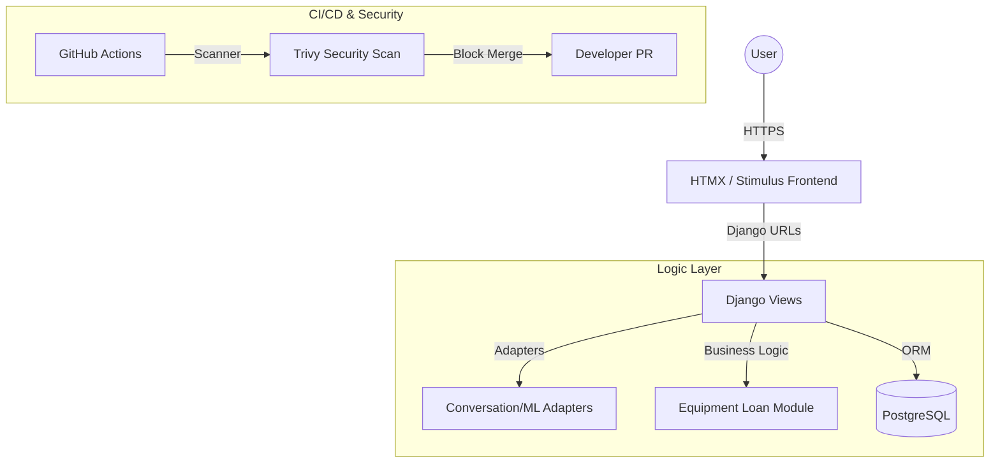
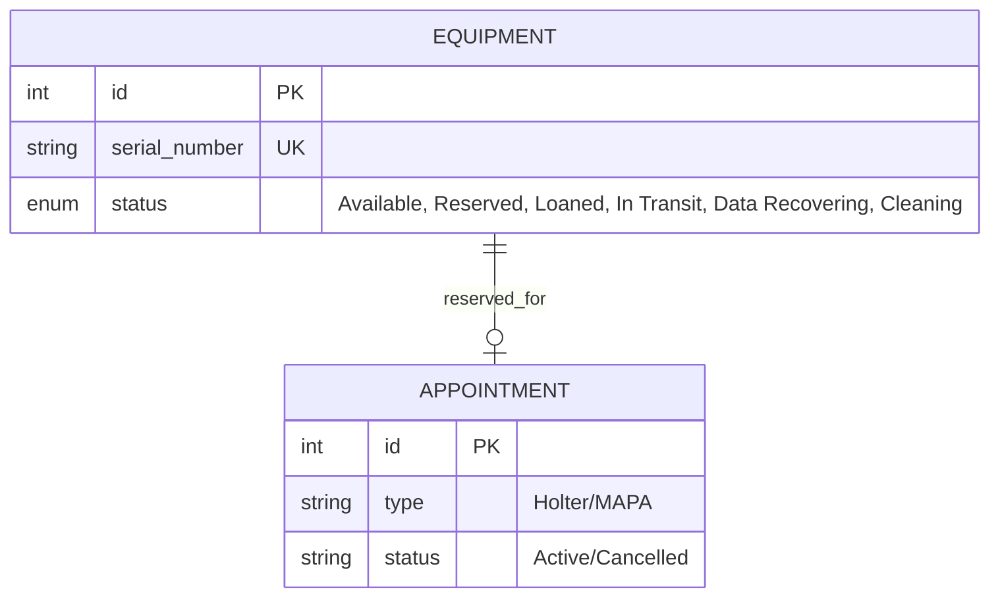
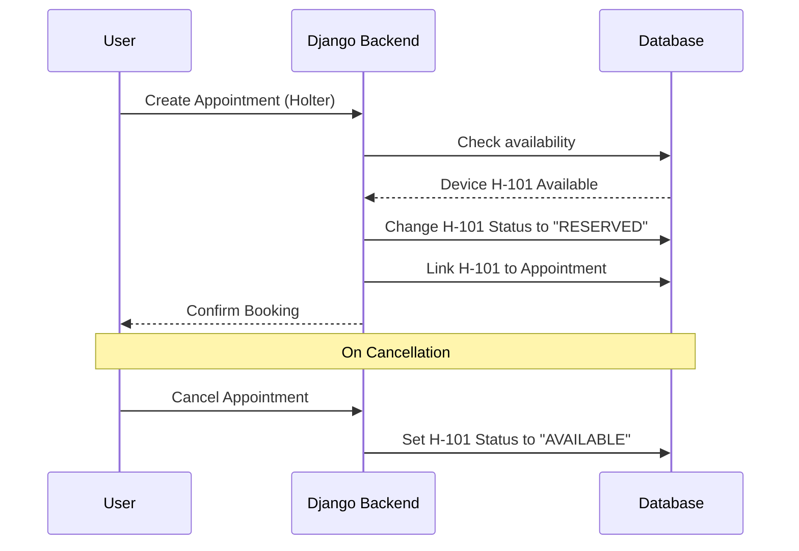

# 🚀 Stage 3 Report: Technical Documentation (CardioBot)

This document provides the technical blueprint for the **CardioBot**, strictly derived from the existing codebase and the Holter Loaning business guide.

---

## User Stories & Mockups 👤

### Prioritized User Stories (MoSCoW)

| Priority | Role | User Story |
| --- | --- | --- |
| **Must Have** | **Receptionist** | As a receptionist, I want the system to **automatically reserve** hardware when I create a "Holter" appointment to prevent double-booking. |
| **Must Have** | **Practitioner** | As a doctor, I want an **automated triage summary** of patient symptoms to prioritize high-risk cases. |
| **Must Have** | **Receptionist** | As a receptionist, I want hardware to be **auto-released** if an appointment is cancelled. |
| **Should Have** | **Practitioner** | As a practitioner, I want a **PDF invoice generation** tool to replace manual billing. |

### UI Mockups (BEM/HTMX Style)

The UI follows the **BEM (Block Element Modifier)** methodology found in the project's CSS guides. The dashboard uses **HTMX** for partial page refreshes to maintain a fast "1-click" feel.

---

## System Architecture 🏗️

The application uses a **Django-based architecture** with a specific focus on high-speed frontend interactions via **HTMX and Stimulus**.

### Technical Justifications

* **Django:** Used for its secure ORM and built-in middleware, which supports the project's **ISO 27001/HDS** compliance goals.
* **HTMX & Stimulus:** Used in the project to provide a reactive UI without the complexity of a heavy SPA framework.
* **Trivy:** Integrated into the workflow to ensure no **CRITICAL** vulnerabilities are merged.

---

## Database Design (ER Diagram) 📊

Based on the structure and the loaning guide, the schema focuses on the lifecycle of a medical device.

---

## Sequence Diagrams 🔄

### Automated Loaning Workflow

---

## API Specifications 🔌

### Internal API Endpoints

| Endpoint | Method | Action |
| --- | --- | --- |
| `/api/v1/triage/chat/` | `POST` | Sends patient symptoms to the ML adapter. |
| `/api/v1/equipment/status/` | `GET` | Returns real-time status (Available/In Transit/Cleaning). |
| `/api/v1/billing/invoice/` | `POST` | Generates a PDF invoice for a completed appointment. |

---

## SCM & QA Plans 🛠️

### Source Control Management

* **Tool:** GitHub.
* **Quality Gate:** Mandatory security scan via **Trivy**. Merges are blocked if **CRITICAL** vulnerabilities are found.

### Quality Assurance

* **Unit Testing:** Handled via Django's testing suite .
* **Security Audit:** Automated dependency checks in the CI pipeline.
* **Manual Testing:** Validation of the "Guide Métier" scenarios (Reservation -> Loan -> Return -> Cleaning).

---

## Technical Justifications ⚖️

* **Adapter Pattern:** Used in the directory to decouple ML logic from standard Django views.
* **Dockerization:** The project uses **Docker Compose** to ensure environment parity between development and production, critical for sensitive medical deployments.
* **PostgreSQL:** Chosen for reliability and transactional integrity, preventing double-booking of hardware.